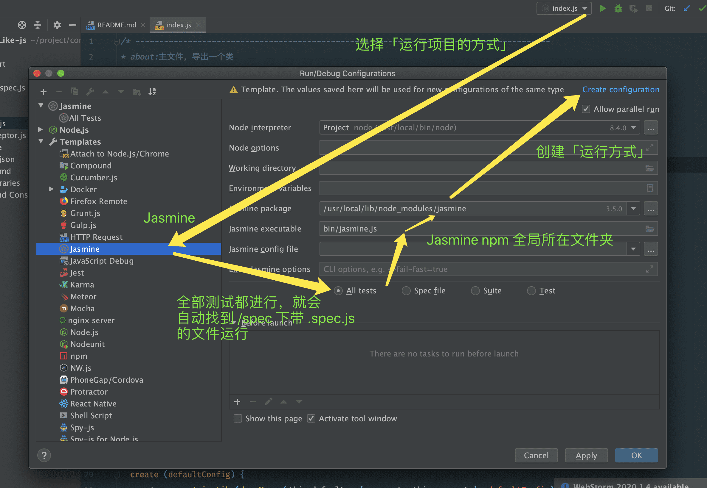
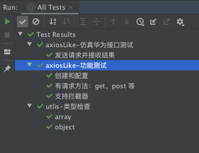

# utils-axiosShell-js

### 简介

☁ fetch 类网络请求的封装库。某些项目、框架不允许直接使用 axios 之类的 HTTP 请求库，所以需要对项目/框架自带的 fetch 请求进行简单封装。

- 【华为小圆】华为不允许直接使用 axios 之类的 http 请求，否则在「厂商测试云」环境会出现 https 请求失败。华为提供的 fetch 请求方法只是简单的回调，没有 Promise 封装、共用配置、超时、拦截器等功能，所以需要当前项目作为 npm 插件。
- 【快应用项目】没有 xhr 对象，也没有 axios 库，只有简单的 fetch 函数。类似功能的快应用网络请求库「Flyjs」又不是很符合 axios 的代码习惯。

### 资料

- 代码设计解读：[【util-axiosShell】代码解读](https://www.yuque.com/orvibo/paene9/clyzgi)
  - 设计基于 Axios，只是把 HTTP 请求部分的功能剔除，传入 request 属性代替这部分
  - 如果对项目进行了更新，请更新文章，维持良好的设计素质

### 开发说明

本项目基于「单元测试驱动」进行开发，就是先写设定功能，再写该功能的单元测试，最后写工程代码，让单元测试通过。纯 js 的工具都建议用这种方式进行开发。

- 启动项目
  - 安装全局 jasmine：`cnpm i jasmine -g`
  - 安装相关 npm 包：`cnpm i`
  - 在 Webstorm 中配置 jasmine 环境并运行（右键-run），如图所示
  - 点击运行，可以启动所有 jasmine 的单元测试（/spec 文件夹下）
  - 查看结果
  - 结果无误后，可以修改 /src 的代码进行功能增加，或者增加 /spec 下的单元测试进行更细致的测试

